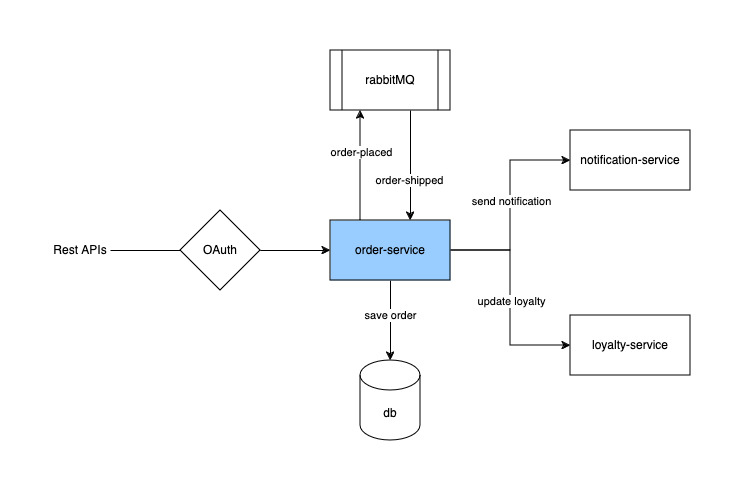

# order-service (integration tests demo)

## The challenge
A common challenge when doing integration tests is that if they are overdone to validate too much logic, they can slow down the test suite delaying feedback and increasing CI time. 

## What this repo does
This repo `order-service` demonstrates how to implement integration tests the right way and avoid overdoing it.

The approach recommended here is to add just the bare minimum integration tests to validate the integration with external components and cover all the remaining logic in unit tests to achieve faster feedback and reduced CI time.

Appropriate number of integration tests are added for each external component that `order-service` integrates with. No unit tests are added as the purpose is to demonstrate integration tests.

Search for "INFO: " text in entire project to understand the reasoning for each integration test.

## External components `order-service` integrates with

1. API services (notification-Service, loyalty-service)
2. Database (postgres)
3. Queue (rabbit-mq)
4. OAuth (okta)

## Running integration tests
```bash
docker-compose down && docker compose run order-service gradle build
```

## Running the app
Spin up postgres and rabbitMQ
```bash
docker-compose down && docker-compose up
```
Run the application with oauth disabled
```bash
./gradlew bootRun --args='--enableAuth=false'
```
Hit the POST / GET order endpoints
```bash
curl -v -X POST http://localhost:8080/api/orders \ 
-H "Content-Type: application/json" \
-d '{
  "customerId": 123,
  "items": [
    {
      "name": "Laptop",
      "qty": 1,
      "price": 50000.00
    },
    {
      "name": "Mouse",
      "qty": 2,
      "price": 1500.00
    }
  ]
}'
```
```bash
curl -v http://localhost:8080/api/orders/2
```

## Notes
- Uses wiremock for mocking APIs services and oauth api calls
- Uses docker containers for spinning up postgres and rabbitmq components for integration tests. Test containers library can be used as an alternative to docker containers.
- Uses flyway for db migration scripts
- Uses dummy public/private key pair (pem files) in test/resources for generating JWT tokens for oauth integration tests
- You may notice test failures if you invoke the endpoints in local and then run integration tests as the RabbitMQ listener will get queued order placed messages from endpoint invocation. Follow [Running integration tests](#running-integration-tests) section to fix the issue. 